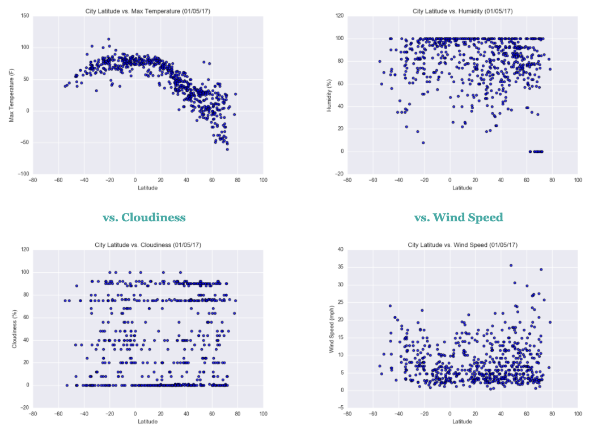

# Web-Design-Challenge
This is the link to myWeb Design Challenge
https://amyp93.github.io/Web-Design-Challenge/
# Introduction
The purpose of this project was to analyze how weather changes as you get closer to the equator. To accomplish this analysis, we first pulled data from the OpenWeatherMap API to assemble a dataset on over 500 cities.

After Assembling the dataset, we used Matplotlib to plot various aspects of the weather vs. latitude. Factors we looked at included: temperature, cloudiness, wind speed, and humidity. This site proves the source dd visualizations created as part of the analysis, as well as explanations and descriptions of any trends and correlations witnessed.
# Overview - Data
Data from OpenWeatherMap API was used with a sampling of 500 cities.
# Methodology
Regression analysis was used to show the relationship to latitude.
# Analysis

